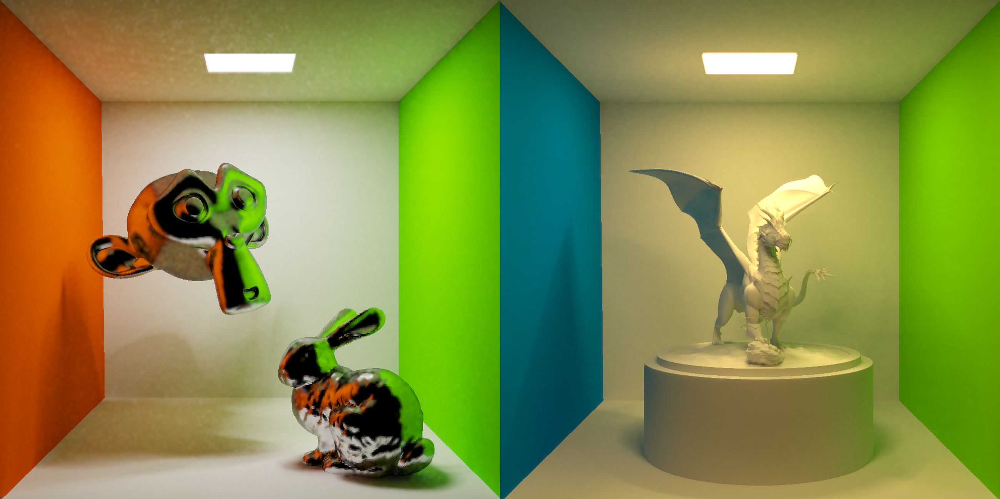

# 基于蒙特卡洛方法的路径追踪渲染器

## Build

克隆本仓库，执行根目录的 CmakeLists.txt 进行构建。构建成功后会在根目录生成可执行文件 main.exe 。在根目录直接运行。

config.json 用于配置运行时参数。

本仓库开发环境：Windows、GCC、C++17

## Features

- 基于 Surface Area Heuristic 的 BVH 构建
- 针对光源的重要性采样
- 针对 Diffuse 材质的余弦重要性采样
- 针对 Speular 材质的 GGX 重要性采样
- 基于联合双边滤波的降噪
- ACES 色调映射
- FXAA 后处理

具体实现见 [Document](Document.md)

## Todo

- GPU并行的 BVH 构建
- 边缘反走样
- 滤波优化